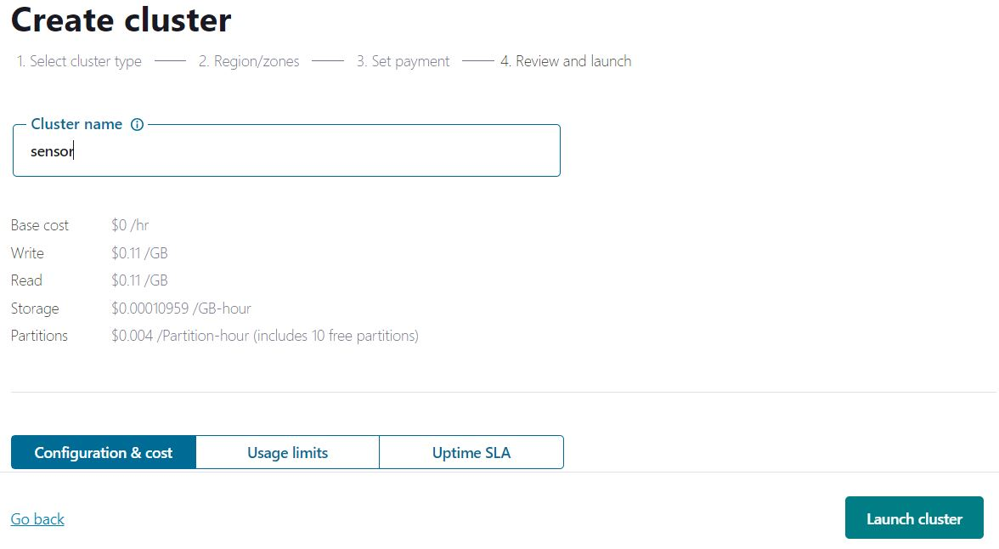

# kafka-pipeline

Step 1: Firstly, will create the folder structure. Here, we write a code to create the folder structure.
```python
touch template.py
python template.py
```

step 2: Update requirements.txt by updating all the required libraries

Step 3: Update setup.py with all the project info and function to install the requirements mentioned in the requirements.txt

step 4: check conda installed or not
```
conda --version
```

step 5: Create conda environment
```
conda create -n env python=3.8 -y
```

step 6: Activate conda 
```
conda activate env
```

step 7: install requirements
```
pip install -r requirements.txt
```

step 8: Let's walk through the confluent kafka
- 1. Go to confluent kafka and create account [Confluent Kafka](https://www.confluent.io/get-started/)

- 2. Sign in and you see the home page like this

- 3. Now, Create cluster.
    - Go to home page, click on environments -> default -> Add cluster -> Basic configuration
     ->  ->  -> 
    - If incase it ask payments to add card, skip it.
    - Choose your cloud either AWS, GCP or Microsoft Azure. I am going with GCP with  Virginia Region
    
    - Give name to cluster and Lunch cluster
    
    - After lunch, your cluster look like screenshot below
    
- 4. Create API keys for the above created cluster
    - Cluster -> API Keys -> create key -> Global access
    
    
    
    - API credential downloaded into your local system. The content looks like below. For security purpose i have made some changes to below credential. This credential doesn't works for you

    ```bash
    === Confluent Cloud API key: lkc-v6vp0n ===

    API key:
    5KETAAIDJST9SSWH7YG

    API secret:
    K1kkZcllrdsfadfjasdfonkadfSEaasdfsdaSSDbiIYcuux53qiuWuNTBSb9cFmW

    Bootstrap server:
    thc-532pq.in-east1.gcp.confluent.cloud:9092

    ```
- 5. Now, Create Topic to store the data. 
    - cluster -> Topic -> Create topic
    - provide topic and paritions(By default 6)
    - create
    
    
    - After topic created, we need to set the schema
    
    - Click on set a schema and select Basic Configuration.
    
    - If you create schema properly. You will see Stream API details like below screenshot
    
    - For the above stream API, we should need api credentials. Click on API key in the below screenshot
    
    - Once your create api details, you can download the credential file which contains API KEY and SECRET. The file content looks like this
    ```
    === Confluent Cloud API key: hyfc-uhg7kd ===

    API key:
    BBDTSJUR5HSDHSYHHL

    API secret:
    yfxKIdJYqsdfasdyufjnbavgdhfuagdhfs1Im+mnrHTbhbi/ArjwROkSROGEk2GXT1fDNAav

    ```
    - Copy the schema End point URL
    
    ```
    SCHEMA_REGISTRY_ENDPOINT = https://ltdr-4yfrk.in-east-1.aws.confluent.cloud
    ```

Step 9: create .env file in the root directory and store all the credentials 

Step 10: import all the credentials to src/kafka_config/__init__py